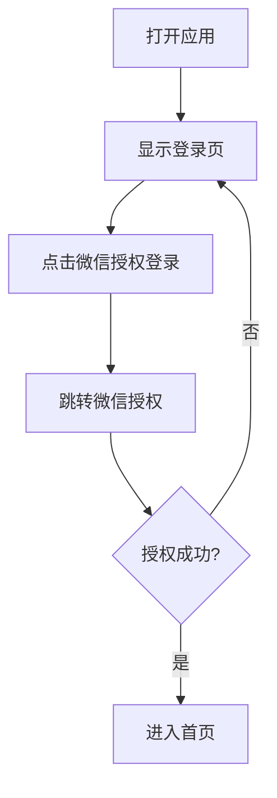

# "今天吃什么"产品需求文档（PRD）

## 文档信息

| 项目 | 内容 |
|------|------|
| 产品名称 | 今天吃什么 |
| 文档版本 | v3.3 |
| 创建日期 | 2026-01-15 |
| 产品经理 | AI Product Manager |
| 目标用户 | 朋友、情侣 |

---

## 1. 产品概述

### 1.1 产品定位
"今天吃什么"是一款面向朋友、情侣的菜品推荐应用。用户可以浏览菜品、点菜并推送给好友，好友可以查看已推送的菜单列表，共同决定今天吃什么。

### 1.2 核心价值
- **解决选择困难**：不用再纠结"吃什么"，推荐给好友一起看
- **简单推送**：点好菜后一键推送给好友
- **查看推荐**：好友可以看到你推送的菜品列表
- **双向互动**：你也可以看到好友推送给你的菜单

### 1.3 目标用户
- **主要用户**：朋友群体、情侣、室友（年龄18-35岁，经常一起吃饭）
- **使用场景**：
  - 朋友聚餐时推荐去哪家店吃什么菜
  - 情侣约会时讨论今天的晚餐
  - 室合点外卖时讨论点什么菜
  - 家庭成员讨论今天的菜谱

---

## 2. 用户故事

### 故事1：微信登录
**作为** 一个新用户
**我想要** 通过微信快速登录
**这样** 我就能使用应用的所有功能

**验收标准：**
- 打开应用显示微信登录页面
- 点击"微信授权登录"按钮
- 跳转微信授权
- 授权成功后进入首页

---

### 故事2：开始点菜
**作为** 一个想推荐菜品的用户
**我想要** 浏览菜品并添加到购物车
**这样** 我可以挑选我想吃的菜品

**验收标准：**
- 首页点击"开始点菜"
- 进入点菜页面，左侧显示分类导航（热菜、凉菜、主食等）
- 点击分类切换菜品列表
- 每个菜品显示图片、名称、描述、价格
- 点击"+"按钮添加到购物车
- 底部显示购物车（商品数量、总价）

---

### 故事3：推送菜单给好友
**作为** 一个选好菜品的用户
**我想要** 一键推送给好友
**这样** 好友就能看到我推荐的菜品

**验收标准：**
- 在购物车中查看已选菜品
- 点击"推送菜单"按钮
- 推送成功后显示提示
- 好友可以在"已推送菜单"里看到

---

### 故事4：查看好友推送的菜单
**作为** 一个收到推送的用户
**我想要** 查看好友推送了什么菜品
**这样** 我能了解好友想吃什么

**验收标准：**
- 首页点击"查看已推送菜单"
- 看到所有好友推送的菜品列表
- 每条推送显示：推送人、菜品列表、总价、推送时间
- 可以删除自己推送的菜单

---

### 故事5：扫码添加好友
**作为** 一个用户
**我想要** 通过扫描好友的二维码添加好友
**这样** 我们可以互相推送菜单

**验收标准：**
- 首页点击"扫一扫"
- 进入扫码页面
- 扫描好友二维码
- 扫描成功后添加好友

---

### 故事6：查看我的二维码
**作为** 一个用户
**我想要** 显示我的二维码供好友扫描
**这样** 好友可以添加我为好友

**验收标准：**
- 首页点击"添加好友"
- 显示个人二维码
- 好友扫描后即可添加好友

---

### 故事7：上传菜品
**作为** 一个想分享菜品的用户
**我想要** 上传菜品图片和介绍
**这样** 我可以把我的推荐加入点菜列表

**验收标准：**
- 点击"上传菜单"
- 选择菜品图片
- 输入菜品名称、描述、价格、分类
- 提交后菜品出现在点菜页面的对应分类中

---

### 故事8：相册记录（生活记录模块）
**作为** 一个记录生活的用户
**我想要** 上传照片到相册并可以同步到百度网盘
**这样** 我可以保存生活回忆并有云端备份

**验收标准：**
- 首页点击"我的相册"按钮进入相册页面
- 照片列表采用3列网格布局展示
- 点击"添加照片"按钮：
  - **拍照上传**：
    - 自动检查并请求相机权限
    - 打开系统相机拍摄照片
    - 拍摄后自动处理并上传
    - 自动旋转图片（根据EXIF信息修正方向）
    - 自动压缩图片（超过2MB压缩至1MB以内）
  - **从相册选择**：
    - 自动检查并请求存储权限
    - 打开系统相册
    - 选择照片后自动处理并上传
- 上传过程：
  - 后台线程处理图片（避免阻塞UI）
  - 显示"处理图片..."进度提示
  - 显示"上传中..."进度提示
  - 上传成功后自动刷新照片列表
  - 自动删除临时文件
- 空状态提示：暂无照片，点击下方按钮添加
- 支持为照片添加描述文字（后续功能）
- 点击"同步到百度网盘"可单张同步（后续功能）
- 支持批量选择照片一键同步（后续功能）
- 查看照片时显示同步状态（已同步✅/未同步⏳）

**注意：** 此模块为独立的生活记录功能，与菜品上传功能完全无关。

**权限需求：**
- Android 12及以下：CAMERA、WRITE_EXTERNAL_STORAGE
- Android 13及以上：CAMERA、READ_MEDIA_IMAGES

---

## 3. 功能需求

### 3.1 核心功能模块

#### 3.1.1 登录页

**功能描述：**
用户首次打开应用显示的页面，支持微信授权登录。

**页面元素：**
- **品牌标识区域**
  - 刀叉图标（白色，40×40px）
  - 主标题："今天吃什么"（白色，32px，加粗）
  - 副标题："推荐菜品给好友，一起决定吃什么"（白色，16px）

- **登录按钮**
  - 微信图标 + "微信授权登录"按钮
  - 浅橙色背景（#FF8533），白色文字（与主题色协调）

**视觉规范：**
- 背景色：橙色（#FF6600）
- 按钮圆角：20px

---

#### 3.1.2 首页（登录后的主页）

**功能描述：**
用户登录后的主页面，提供核心功能入口。

**页面布局：**
- **顶部用户信息栏**
  - 用户头像和昵称
  - 退出登录按钮

- **功能按钮区**（2列网格布局）
  1. **开始点菜**（主功能，横跨两列）
     - 图标：🍽️
     - 文字："开始点菜"
     - 点击进入点菜页面

  2. **上传菜单**
     - 图标：📤
     - 文字："上传菜单"
     - 点击上传新菜品

  3. **已推送菜单**
     - 图标：📋
     - 文字："已推送菜单"
     - 点击查看推送历史

  4. **扫一扫**（好友功能）
     - 图标：📷
     - 文字："扫一扫"
     - 点击扫描好友二维码

  5. **添加好友**（好友功能）
     - 图标：📱
     - 文字："添加好友"
     - 点击显示个人二维码

  6. **相册模块**
     - 图标：📸
     - 文字："相册模块"
     - 点击进入相册记录页面
     - 位置：页面右下角悬浮按钮或固定按钮

---

#### 3.1.3 点菜页面（核心功能）

**功能描述：**
浏览菜品、添加到购物车、推送菜单给好友。

**页面布局：**
- **顶部标题栏**
  - 返回按钮
  - 标题："在线点餐"

- **左侧分类导航**
  - 热菜（默认选中）
  - 凉菜
  - 主食
  - 面食
  - 汤品
  - 甜点
  - 饮品

- **中间菜品列表**
  - 菜品图片
  - 菜品名称
  - 菜品描述
  - 价格（橙色）
  - "+"按钮（添加到购物车）

- **底部购物车**
  - 购物车图标
  - 商品数量徽章
  - "共X件"
  - 总价"¥XX"
  - "查看购物车"按钮

- **购物车展开面板**
  - 已选菜品列表
  - 每个菜品：图片、名称、价格、数量（带加减按钮）、删除按钮
  - 数量控制：点击"+"增加数量，点击"-"减少数量（数量为1时询问是否删除）
  - 统计信息：共X件、合计¥XX
  - "推送菜单"按钮

**交互逻辑：**
- 点击分类 → 切换菜品列表
- 点击"+" → 添加到购物车
- 点击"查看购物车" → 展开购物车面板
- 点击"推送菜单" → 推送成功 → 返回首页

---

#### 3.1.4 已推送菜单页面

**功能描述：**
查看自己和好友推送的所有菜单记录。

**页面结构：**
- **顶部标题栏**
  - 返回按钮
  - 标题："已推送菜单"

- **推送列表**（按时间倒序）

每条推送记录包含：
```
┌─────────────────────────────────────┐
│ [头像] 张三推送 · 5分钟前             │
│ [删除按钮] 🗑️                        │
├─────────────────────────────────────┤
│ [图片] 麻婆豆腐    x1      ¥28      │
│ [图片] 宫保鸡丁    x1      ¥38      │
│ [图片] 红烧肉      x1      ¥45      │
├─────────────────────────────────────┤
│ 总计：¥111                           │
└─────────────────────────────────────┘
```

**显示内容：**
- 菜品缩略图（60×60px）
- 菜品名称
- 数量（xN）
- 单价（橙色）

**权限控制：**
- 只能删除自己推送的菜单
- 不能删除好友的推送

---

#### 3.1.5 我的二维码页面

**功能描述：**
显示用户的个人二维码，供好友扫描添加好友。

**页面布局：**
- **顶部标题栏**
  - 返回按钮
  - 标题："我的二维码"

- **二维码展示区**
  - 用户头像
  - 用户昵称
  - 二维码图片（包含用户ID信息）
  - 提示文字："让好友扫描二维码，即可添加你为好友"

- **操作按钮**
  - "分享给好友"按钮

**技术实现：**
- 二维码内容包含用户唯一标识ID
- 使用微信内置JS-SDK生成二维码
- 或使用后端API生成二维码图片

---

#### 3.1.6 扫一扫页面

**功能描述：**
扫描好友二维码，添加好友关系。

**页面布局：**
- **顶部标题栏**
  - 返回按钮
  - 标题："扫一扫"

- **扫码区域**
  - 扫码取景框（正方形，带扫描动画）
  - 提示文字："将二维码放入框内，即可自动扫描"

- **扫码结果处理**
  - 扫描成功：显示好友信息卡片
    - 好友头像、昵称
    - "添加好友"按钮
  - 扫描失败：提示重新扫描

**交互逻辑：**
- 解析二维码获取好友用户ID
- 调用API建立好友关系
- 添加成功后显示提示并返回

**技术实现：**
- 使用微信内置JS-SDK的扫一扫功能
- 或使用HTML5 + WebRTC调用摄像头
- 解析二维码获取用户ID

---

#### 3.1.7 上传菜单页面

**功能描述：**
用户上传新菜品到点菜列表。

**页面元素：**
1. **图片上传区**
   - 拍照或从相册选择
   - 预览上传的图片

2. **菜品信息输入**
   - 菜品名称（必填，最多20字）
   - 菜品描述（选填，最多100字）
   - 价格（必填）
   - 分类选择（必填）

3. **操作按钮**
   - "提交"按钮
   - "取消"按钮

**技术要求：**
- 图片压缩（最大2MB）
- 支持jpg、png格式

---

#### 3.1.6 个人信息页面

**功能描述：**
查看和编辑用户个人信息。

**页面内容：**
- 用户头像和昵称
- 微信ID
- 统计数据：
  - 推送次数
  - 上传菜品数
  - 好友数量
- 退出登录按钮

---

## 4. 关键权限逻辑

### 4.1 删除权限控制

| 操作 | 自己的推送 | 他人的推送 |
|------|-----------|-----------|
| 查看内容 | ✅ | ✅ |
| 删除 | ✅ 显示删除按钮 | ❌ 不显示删除按钮 |

**实现逻辑：**
```javascript
if (currentUserId === push.pusherUserId) {
  showDeleteButton = true
} else {
  showDeleteButton = false
}
```

---

## 5. 数据模型

### 5.1 用户表（User）

| 字段 | 类型 | 说明 |
|------|------|------|
| user_id | String | 用户唯一标识 |
| nickname | String | 用户昵称 |
| avatar | String | 头像URL |
| wechat_openid | String | 微信OpenID |
| created_at | Timestamp | 注册时间 |

### 5.2 菜品表（Dish）

| 字段 | 类型 | 说明 |
|------|------|------|
| dish_id | String | 菜品唯一标识 |
| name | String | 菜品名称 |
| description | String | 菜品描述 |
| price | Decimal | 价格 |
| category | String | 分类（热菜/凉菜/主食等） |
| image_url | String | 菜品图片URL |
| uploader_id | String | 上传者ID |
| created_at | Timestamp | 创建时间 |

### 5.3 推送记录表（Push）

| 字段 | 类型 | 说明 |
|------|------|------|
| push_id | String | 推送唯一标识 |
| pusher_id | String | 推送人ID |
| pusher_name | String | 推送人昵称（快照） |
| pusher_avatar | String | 推送人头像（快照） |
| dishes | JSON | 菜品列表（包含dish_id, name, price, quantity） |
| total_amount | Decimal | 总金额 |
| created_at | Timestamp | 推送时间 |

### 5.4 好友关系表（Friendship）

| 字段 | 类型 | 说明 |
|------|------|------|
| id | String | 记录唯一标识 |
| user_id | String | 用户ID |
| friend_id | String | 好友ID |
| created_at | Timestamp | 绑定时间 |

### 5.5 相片表（Photo）

| 字段 | 类型 | 说明 |
|------|------|------|
| photo_id | String | 照片唯一标识 |
| user_id | String | 上传者ID |
| image_url | String | 服务器存储的图片URL |
| baidu_file_id | String | 百度网盘文件ID（可为空，表示未同步） |
| description | String | 照片描述（选填） |
| file_size | Long | 文件大小（字节） |
| is_synced | Boolean | 是否已同步到百度网盘 |
| created_at | Timestamp | 上传时间 |
| updated_at | Timestamp | 更新时间 |

---

## 6. 交互流程

### 6.1 登录流程



### 6.2 点菜并推送流程

```mermaid
graph TD
    A[首页] --> B[点击"开始点菜"]
    B --> C[选择分类]
    C --> D[浏览菜品]
    D --> E[点击"+"添加]
    E --> F[查看购物车]
    F --> G{继续点菜?}
    G -->|是| C
    G -->|否| H[点击"推送菜单"]
    H --> I[推送成功]
    I --> J[返回首页]
```

### 6.3 查看已推送菜单流程

```mermaid
graph TD
    A[首页] --> B[点击"已推送菜单"]
    B --> C[查看推送列表]
    C --> D{是否自己的推送?}
    D -->|是| E[显示删除按钮]
    D -->|否| F[不显示删除按钮]
    E --> G[点击删除]
    G --> H[确认删除]
    H --> I[删除成功]
```

### 6.4 相册上传流程

```mermaid
graph TD
    A[首页] --> B[点击"我的相册"]
    B --> C[进入相册页面]
    C --> D[点击"添加照片"]
    D --> E[选择拍照或相册]
    E --> F[选择照片]
    F --> G[预览照片]
    G --> H[添加描述文字]
    H --> I[点击上传]
    I --> J[上传到服务器]
    J --> K[获得永久URL]
    K --> L[显示在相册列表]
    L --> M{自动同步百度网盘?}
    M -->|是| N[异步上传到百度网盘]
    M -->|否| L
    N --> O[保存百度文件ID]
    O --> P[更新同步状态]
```

### 6.5 相册同步流程

```mermaid
graph TD
    A[相册页面] --> B{选择同步方式}
    B -->|单张同步| C[点击照片]
    B -->|批量同步| D[点击"选择"进入编辑模式]
    C --> E[点击"同步到百度网盘"]
    D --> F[多选照片]
    F --> G[点击"批量同步"]
    E --> H[上传到百度网盘]
    G --> H
    H --> I[保存百度文件ID]
    I --> J[更新同步状态为已同步]
    J --> K[显示同步成功提示]
```

---

## 7. 页面跳转关系

| 当前页面 | 操作 | 目标页面 |
|---------|------|---------|
| 登录页 | 微信授权成功 | 首页 |
| 首页 | 点击"开始点菜" | 点菜页面 |
| 首页 | 点击"上传菜单" | 上传菜单页面 |
| 首页 | 点击"已推送菜单" | 已推送菜单页面 |
| 首页 | 点击"扫一扫" | 扫一扫页面 |
| 首页 | 点击"添加好友" | 我的二维码页面 |
| 首页 | 点击"我的相册" | 我的相册页面 |
| 点菜页面 | 点击"推送菜单"成功 | 首页 |
| 点菜页面 | 点击返回 | 首页 |
| 扫一扫页面 | 扫描成功并添加好友 | 首页 |
| 我的二维码页面 | 点击返回 | 首页 |
| 我的相册页面 | 点击返回 | 首页 |

---

## 8. UI设计规范

### 8.1 色彩体系

| 颜色名称 | 色值 | 使用场景 |
|---------|------|---------|
| 主色（橙色） | #FF6600 | 标题栏、按钮、选中状态、价格 |
| 辅助色（白色） | #FFFFFF | 按钮、卡片背景、主文字 |
| 背景色 | #F5F5F5 | 页面背景 |
| 文字主色 | #333333 | 标题、正文 |
| 文字辅色 | #999999 | 描述、时间戳 |
| 删除按钮色 | #F5222D | 删除按钮 |
| 购物车背景 | #1E293B | 底部购物车栏 |

### 8.2 字体规范

| 使用场景 | 字体大小 | 字重 | 行高 |
|---------|---------|------|------|
| 页面标题 | 32px | Bold | 1.2 |
| 菜品名称 | 16px | Bold | 1.4 |
| 按钮文字 | 16-18px | Medium | 1.4 |
| 正文/描述 | 14px | Regular | 1.5 |
| 小字 | 12px | Regular | 1.5 |

### 8.3 间距规范

| 间距类型 | 数值 | 使用场景 |
|---------|------|---------|
| 页面边距 | 16px | 页面内容与屏幕边缘 |
| 卡片间距 | 12px | 菜品卡片之间 |
| 元素间距 | 8px | 卡片内元素之间 |
| 按钮间距 | 15px | 按钮之间 |
| 圆角 | 8-20px | 卡片、按钮 |

---

## 9. 核心业务规则

### 9.1 点菜规则
- 每个用户可以添加多个菜品到购物车
- 同一菜品可以多次添加
- **数量控制**：
  - 点击"+"按钮增加数量
  - 点击"-"按钮减少数量
  - 数量为1时，点击"-"会询问是否删除
- 支持直接删除购物车中的菜品

### 9.2 推送规则
- 点击"推送菜单"后，购物车中的所有菜品推送给好友
- 推送后购物车清空
- 推送记录保存在"已推送菜单"
- 好友可以实时看到新推送

### 9.3 权限规则（重要）
- **只有推送者本人可以删除自己的推送**
- 任何人都可以查看所有推送
- 无法删除他人的推送

### 9.4 上传规则
- 登录用户都可以上传菜品
- 上传后所有用户都能看到
- 可以上传到任意分类

### 9.5 相册规则
- 登录用户都可以上传照片到个人相册
- 照片仅本人可见，不与其他用户共享
- 主存储：服务器本地存储（/root/what2eat/uploads/photos/）
- 备份存储：百度网盘（用户自己的网盘空间）
- **同步规则**：
  - 照片上传后自动保存到服务器
  - 可选择自动同步或手动同步到百度网盘
  - 单张同步：点击照片详情页的"同步到百度网盘"按钮
  - 批量同步：进入编辑模式，多选照片后批量同步
- **删除规则**：
  - 只能删除自己的照片
  - 删除服务器照片时，可选是否同时删除百度网盘文件
- **图片处理**：
  - 大于2MB的图片自动压缩至1MB以内
  - 支持格式：jpg、png、heic（自动转换为jpg）
  - 自动生成200×200px缩略图

---

## 10. 非功能需求

### 10.1 性能要求
- 页面加载时间 < 2秒
- 图片上传速度 < 5秒（2MB以内）
- 推送实时性 < 1秒

### 10.2 安全要求
- 用户数据加密存储
- 图片传输使用HTTPS
- 防止恶意上传

### 10.3 兼容性要求
- 支持iOS 12.0+、Android 8.0+
- 支持微信内嵌浏览器

---

## 11. 开发优先级

### P0（必须实现 - MVP）
1. ✅ 微信登录
2. ✅ 首页（4个功能入口）
3. ✅ 点菜页面（分类导航、菜品列表、购物车）
4. ✅ 推送菜单功能
5. ✅ 已推送菜单查看
6. ✅ 删除权限控制

### P1（重要）
1. 上传菜单功能
2. 个人信息页面
3. 图片压缩
4. 实时推送通知
5. 相册记录模块
   - 照片上传
   - 相册查看
   - 百度网盘同步（单张+批量）
   - 同步状态显示

### P2（可选）
1. 修改菜品数量
2. 菜品搜索
3. 收藏菜品
4. 暗黑模式

---

## 12. 测试要点

### 12.1 功能测试
- [ ] 微信登录成功
- [ ] 点菜页面分类切换正常
- [ ] 添加购物车功能
- [ ] 推送菜单成功
- [ ] 已推送菜单显示正确
- [ ] 只有自己的推送显示删除按钮
- [ ] 删除后列表更新

### 12.2 权限测试
- [ ] 用户A无法删除用户B的推送
- [ ] 用户B无法删除用户A的推送

### 12.3 相册功能测试
- [ ] 照片上传成功
- [ ] 照片正确显示在相册列表
- [ ] 照片描述正确保存和显示
- [ ] 单张照片同步到百度网盘成功
- [ ] 批量照片同步到百度网盘成功
- [ ] 同步状态正确显示（已同步/未同步）
- [ ] 删除照片功能正常
- [ ] 大于2MB的图片自动压缩
- [ ] 照片仅本人可见，其他用户无法查看

---

## 13. 附录

### 13.1 参考资料
- Figma设计稿：https://www.figma.com/make/nsDkAzp0UlbZQVcGAlRPM0/
- HTML预览：https://setup-slash-40013552.figma.site/

### 13.2 术语表
- **推送菜单**：将购物车中的菜品发送给好友
- **已推送菜单**：历史推送记录列表
- **点菜**：浏览并选择菜品添加到购物车

### 13.3 变更记录

| 版本 | 日期 | 变更内容 | 修改人 |
|------|------|---------|--------|
| v1.0 | 2026-01-15 | 初始版本（错误理解） | AI PM |
| v2.0 | 2026-01-15 | 修正为讨论空间（仍错误） | AI PM |
| v3.0 | 2026-01-15 | 修正为点菜推送系统（正确） | AI PM |
| v3.1 | 2026-01-26 | 新增相册记录模块需求 | AI PM |
| v3.2 | 2026-01-26 | 完善相册上传功能细节：权限处理、拍照/相册选择、图片压缩、EXIF旋转处理 | AI PM |
| v3.3 | 2026-01-26 | 修复图片上传验证逻辑：改用文件扩展名验证为主，支持application/octet-stream类型 | AI PM |

---

**文档结束**
